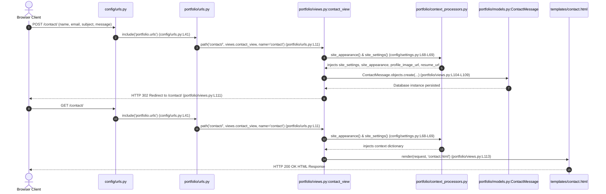

# System Architecture Documentation

## 1. OVERVIEW

This system is a personal portfolio web application built with Django that renders a professional resume site, showcase of projects, capability matrix, event history, education timeline, blog engine, and visitor contact form handler. It processes client HTTP requests through a single Django app (`portfolio`) and renders server-side HTML templates styled with Tailwind CSS, custom CSS, and vanilla JavaScript.

### Tech Stack & Dependencies
* **Framework**: `Django` (`>=5.0,<6.0`, specified in `requirements.txt:L1`; project generator header references Django 6.0 in `config/settings.py:L4`).
* **Image Processing**: `Pillow` (`>=10.0.0`, `requirements.txt:L2`).
* **Database Driver**: `mysqlclient` (`>=2.2.0`, `requirements.txt:L3`).
* **Database Engines**:
  * SQLite3 (`db.sqlite3`) configured for local development (`config/settings.py:L82-L87` and `config/settings_local.py:L4-L9`).
  * MySQL engine block configured for production deployment (`config/settings.py:L90-L102` and `PYTHONANYWHERE_DEPLOY.md:L18-L31`).
* **Frontend**: Tailwind CSS CDN (`templates/index.html:L15`), FontAwesome 6.0.0 CDN (`templates/index.html:L17`), AOS animation library (`templates/index.html:L18`), custom stylesheet (`static/styles.css`), and custom script (`static/script.js`).

### Hosting & WSGI Execution Environment
The project targets hosting on PythonAnywhere (`bunnypraneeth.pythonanywhere.com`). Standard WSGI entrypoint `config/wsgi.py` routes requests. Settings dynamically evaluate `DEBUG`, `SECRET_KEY`, and `ALLOWED_HOSTS` via `os.environ` (`config/settings.py:L25-L40`). An environment setup pattern for PythonAnywhere is provided in `_backup/wsgi_pythonanywhere.py`.

---

## 2. REQUEST LIFECYCLE

The system routes requests starting from root `config/urls.py`, forwarding to `portfolio/urls.py`, dispatching to view functions in `portfolio/views.py`, running context processors in `portfolio/context_processors.py`, and rendering Django HTML templates.

### Sequence Diagram: Contact Form Submission & Page Render



### Route Map Summary
1. `/` -> `config/urls.py:L41` -> `portfolio/urls.py:L5` -> `views.index` (`portfolio/views.py:L7-L11`) -> `templates/index.html`
2. `/about/` -> `config/urls.py:L41` -> `portfolio/urls.py:L6` -> `views.about_view` (`portfolio/views.py:L13-L42`) -> `templates/about.html`
3. `/skills/` -> `config/urls.py:L41` -> `portfolio/urls.py:L7` -> `views.skills_view` (`portfolio/views.py:L44-L63`) -> `templates/skills.html`
4. `/projects/` -> `config/urls.py:L41` -> `portfolio/urls.py:L8` -> `views.projects_view` (`portfolio/views.py:L65-L82`) -> `templates/projects.html`
5. `/blog/` -> `config/urls.py:L41` -> `portfolio/urls.py:L9` -> `views.blog_view` (`portfolio/views.py:L84-L86`) -> `templates/blog.html`
6. `/blog/<slug>/` -> `config/urls.py:L41` -> `portfolio/urls.py:L10` -> `views.blog_detail` (`portfolio/views.py:L88-L90`) -> `templates/blog_detail.html`
7. `/contact/` -> `config/urls.py:L41` -> `portfolio/urls.py:L11` -> `views.contact_view` (`portfolio/views.py:L92-L113`) -> `templates/contact.html`
8. `/admin/` -> `config/urls.py:L24` -> `admin.site.urls`
9. Favicon redirect routes -> `config/urls.py:L25-L40` -> `RedirectView.as_view(..., permanent=True)`

---

## 3. DATA MODELS

All models reside in `portfolio/models.py` (`portfolio/models.py:L1-L398`). No relational foreign key, one-to-one, or many-to-many fields exist across models in this codebase.

### `About` (`portfolio/models.py:L5-L29`)
* **Fields**:
  * `title`: `CharField(max_length=200)`
  * `description`: `TextField()`
  * `bio_paragraph_1`: `TextField(blank=True)`
  * `bio_paragraph_2`: `TextField(blank=True)`
  * `bio_paragraph_3`: `TextField(blank=True)`
  * `stat_accuracy`: `CharField(max_length=20, default='99.88%')`
  * `stat_accuracy_label`: `CharField(max_length=50, default='Detection Accuracy')`
  * `stat_agents`: `CharField(max_length=20, default='4')`
  * `stat_agents_label`: `CharField(max_length=50, default='MCP Agents Built')`
  * `stat_teams`: `CharField(max_length=20, default='25+')`
  * `stat_teams_label`: `CharField(max_length=50, default='Teams at TechTrotter 2K25')`
  * `stat_projects`: `CharField(max_length=20, default='3')`
  * `stat_projects_label`: `CharField(max_length=50, default='Major Projects')`
  * `subtitle`: `CharField(max_length=200, default='Agentic AI Engineer · B.Tech CSE-AI · Kurnool, India')`
* **Relationships**: None.
* **Methods**: `__str__` returns `self.title`. Meta: `verbose_name_plural = "About"`.

### `Skill` (`portfolio/models.py:L30-L51`)
* **Fields**:
  * `name`: `CharField(max_length=100)`
  * `category`: `CharField(max_length=30, choices=CATEGORY_CHOICES, default='tools')`. Choices: `agentic`, `ml`, `web`, `languages`, `security`, `tools`, `soft`.
  * `is_featured`: `BooleanField(default=False)`
  * `order`: `IntegerField(default=0)`
* **Relationships**: None.
* **Methods**: `__str__` returns `self.name`. Meta ordering: `['category', 'order', 'name']`.

### `SiteAppearance` (`portfolio/models.py:L52-L64`)
* **Fields**:
  * `primary_color`: `CharField(max_length=7, default='#3b82f6')`
  * `secondary_color`: `CharField(max_length=7, default='#8b5cf6')`
  * `accent_color`: `CharField(max_length=7, default='#06b6d4')`
  * `updated_at`: `DateTimeField(auto_now=True)`
* **Relationships**: None.
* **Methods**: `__str__` returns `'Site Appearance'`. Meta: `verbose_name_plural = 'Site Appearance'`.

### `SiteSettings` (`portfolio/models.py:L83-L164`)
* **Fields**:
  * `profile_image`: `ImageField(upload_to='appearance/', blank=True, null=True)`
  * `resume`: `FileField(upload_to='resume/', blank=True, null=True)`
  * `hero_name_display`: `CharField(max_length=100, default='Karu Praneeth Kumar')`
  * `hero_roles`: `TextField(default='Agentic AI Engineer\nML Practitioner\nFull Stack Developer')`
  * `hero_description`: `TextField(...)`
  * `hero_cta_primary_label`: `CharField(max_length=50, default='Begin the Story')`
  * `hero_cta_primary_url`: `CharField(max_length=200, default='/about/')`
  * `hero_cta_secondary_label`: `CharField(max_length=50, default='View the Work')`
  * `hero_cta_secondary_url`: `CharField(max_length=200, default='/projects/')`
  * `github_url`: `URLField(blank=True, default='https://github.com/BunnyPraneeth5')`
  * `linkedin_url`: `URLField(blank=True, default='https://linkedin.com/in/karu-praneeth-kumar')`
  * `kaggle_url`: `URLField(blank=True, default='https://www.kaggle.com/bunnypraneeth5')`
  * `hackerrank_url`: `URLField(blank=True, default='https://hackerrank.com/profile/karu_praneeth')`
  * `leetcode_url`: `URLField(blank=True, default='https://leetcode.com/u/praneethkumar_/')`
  * `contact_email`: `EmailField(default='karupraneethkumar@gmail.com')`
  * `contact_location`: `CharField(max_length=100, default='Andhra Pradesh, India')`
  * `contact_tagline`: `CharField(max_length=200, default='A quiet place for the next conversation.')`
  * `contact_form_active`: `BooleanField(default=True)`
  * `meta_title`: `CharField(max_length=100, blank=True)`
  * `meta_description`: `CharField(max_length=300, blank=True)`
* **Relationships**: None.
* **Model Logic & Overrides**:
  * `save()` override (`portfolio/models.py:L149-L151`): Forces `self.pk = 1` before invoking superclass save to enforce singleton behavior.
  * `@classmethod load(cls)` (`portfolio/models.py:L153-L156`): Executes `cls.objects.get_or_create(pk=1)`.
  * `@property hero_roles_list` (`portfolio/models.py:L158-L161`): Parses `hero_roles` multiline string into a clean list.

### `Project` (`portfolio/models.py:L166-L258`)
* **Fields**:
  * `title`: `CharField(max_length=200)`
  * `description`: `TextField(blank=True, default='')`
  * `short_description`: `TextField(blank=True)`
  * `long_description`: `TextField(blank=True)`
  * `image`: `ImageField(upload_to='projects/', blank=True, null=True)`
  * `thumbnail`: `ImageField(upload_to='projects/', null=True, blank=True)`
  * `live_url`: `URLField(blank=True)`
  * `live_demo_url`: `URLField(blank=True)`
  * `github_url`: `URLField(blank=True)`
  * `technologies`: `CharField(max_length=300, blank=True, default='')`
  * `tech_tags`: `CharField(max_length=500, blank=True)`
  * `featured`: `BooleanField(default=False)`
  * `is_featured`: `BooleanField(default=False)`
  * `is_published`: `BooleanField(default=True)`
  * `order`: `PositiveIntegerField(default=0)`
  * `metric_kicker`: `CharField(max_length=50, blank=True)`
  * `secondary_kicker`: `CharField(max_length=50, blank=True)`
  * `metric_1_value`: `CharField(max_length=20, blank=True)`
  * `metric_1_label`: `CharField(max_length=50, blank=True)`
  * `metric_2_value`: `CharField(max_length=20, blank=True)`
  * `metric_2_label`: `CharField(max_length=50, blank=True)`
  * `metric_3_value`: `CharField(max_length=20, blank=True)`
  * `metric_3_label`: `CharField(max_length=50, blank=True)`
  * `created_at`: `DateTimeField(auto_now_add=True)`
* **Relationships**: None.
* **Model Logic & Properties**:
  * `save()` override (`portfolio/models.py:L245-L254`): Auto-populates legacy fields (`description` from `short_description`, `technologies` from `tech_tags`, `live_url` from `live_demo_url`, `featured` from `is_featured`).
  * `@property tech_tags_list`: Splits `tech_tags` or `technologies` by comma (`portfolio/models.py:L228-L231`).
  * `@property card_description`: Returns `short_description or description` (`portfolio/models.py:L233-L235`).
  * `@property card_image`: Returns `thumbnail or image` (`portfolio/models.py:L237-L239`).
  * `@property primary_live_url`: Returns `live_demo_url or live_url` (`portfolio/models.py:L241-L243`).

### `BlogPost` (`portfolio/models.py:L259-L275`)
* **Fields**:
  * `title`: `CharField(max_length=200)`
  * `slug`: `SlugField(unique=True)`
  * `event_date`: `DateField(default=date.today)`
  * `content`: `TextField()`
  * `excerpt`: `TextField(max_length=300)`
  * `image`: `ImageField(upload_to='blog/', blank=True, null=True)`
  * `published`: `BooleanField(default=False)`
  * `created_at`: `DateTimeField(auto_now_add=True)`
  * `updated_at`: `DateTimeField(auto_now=True)`
* **Relationships**: None.
* **Methods**: `__str__` returns `self.title`. Meta ordering: `['-created_at']`.

### `ContactMessage` (`portfolio/models.py:L276-L287`)
* **Fields**:
  * `name`: `CharField(max_length=100)`
  * `email`: `EmailField()`
  * `subject`: `CharField(max_length=200)`
  * `message`: `TextField()`
  * `created_at`: `DateTimeField(auto_now_add=True)`
* **Relationships**: None.
* **Methods**: `__str__` returns `f"{self.name} - {self.subject}"`. Meta ordering: `['-created_at']`.

### `WhatIDo` (`portfolio/models.py:L289-L299`)
* **Fields**: `item` (`CharField(max_length=200)`), `order` (`IntegerField(default=0)`).
* **Methods**: `__str__` returns `self.item`. Meta ordering: `['order']`.

### `EducationEntry` (`portfolio/models.py:L301-L316`)
* **Fields**: `year_range` (`CharField(max_length=20)`), `degree` (`CharField(max_length=200)`), `field_of_study` (`CharField(max_length=200)`), `institution` (`CharField(max_length=300)`), `bullet_1` (`CharField(max_length=300, blank=True)`), `bullet_2` (`CharField(max_length=300, blank=True)`), `order` (`IntegerField(default=0)`).
* **Methods**: `__str__` returns `f"{self.degree} - {self.institution}"`. Meta ordering: `['order']`.

### `ExperienceEntry` (`portfolio/models.py:L318-L353`)
* **Fields**: `year_label`, `organization`, `role`, `tags`, `certificate_file` (`upload_to='certificates/'`), `certificate_file_2` (`upload_to='certificates/'`), `icon_class` (`default='fas fa-certificate'`), `icon_color` (`default='text-blue-400'`), `side` (`choices=[('left', 'Left'), ('right', 'Right')]`), `order`.
* **Methods**: `get_tags_list()` splits comma-separated `tags` string (`portfolio/models.py:L347-L350`). Meta ordering: `['order']`.

### `EventEntry` (`portfolio/models.py:L355-L375`)
* **Fields**: `title`, `role`, `year`, `location`, `description`, `stat_1_value`, `stat_1_label`, `stat_2_value`, `stat_2_label`, `stat_3_value`, `stat_3_label`, `order`.
* **Methods**: `__str__` returns `self.title`. Meta ordering: `['order']`.

### `AdditionalCertification` (`portfolio/models.py:L377-L398`)
* **Fields**: `title`, `icon_class`, `icon_color`, `certificate_file` (`upload_to='certificates/'`), `see_experience_note`, `order`.
* **Methods**: `__str__` returns `self.title`. Meta ordering: `['order']`.

---

## 4. ADMIN PANEL MAP

All admin models are defined in `portfolio/admin.py` (`portfolio/admin.py:L14-L239`). Customized admin branding sets site title to "KP Admin" and header to "KP Portfolio Administration" (`portfolio/admin.py:L10-L12`).

| Admin Model | Editable Fields | Live-Site Effect (Template & Section) | Notes |
|---|---|---|---|
| `About` (`portfolio/admin.py:L14-L37`) | `title`, `subtitle`, `image`, `resume`, `bio_paragraph_1`, `bio_paragraph_2`, `bio_paragraph_3`, `description`, `stat_accuracy`, `stat_accuracy_label`, `stat_agents`, `stat_agents_label`, `stat_teams`, `stat_teams_label`, `stat_projects`, `stat_projects_label` | Renders `subtitle`, `bio_paragraph_1-3`, and 4 stat cards (`stat_accuracy`, `stat_agents`, `stat_teams`, `stat_projects`) on `templates/about.html:L81,L90-96,L116-156`. `image` & `resume` serve as fallback profile image and resume URL in `site_settings` context processor (`portfolio/context_processors.py:L26-L35`). | Admin uses fieldsets. Single row fetched via `About.objects.first()` in `portfolio/views.py:L8,L17`. `description` field is in admin fieldset but unused in `about.html`. |
| `Skill` (`portfolio/admin.py:L39-L46`) | `name`, `percentage`, `icon`, `category`, `order`. List editable: `category`, `percentage`, `icon`, `order`. | Renders `name` grouped by `category` on `templates/skills.html:L81-L91`. | Category choices: `agentic`, `ml`, `web`, `languages`, `security`, `tools`, `soft`. View deduplicates skills case-insensitively (`portfolio/views.py:L48-L51`). `percentage` & `icon` fields are in admin but omitted in `skills.html`. |
| `Project` (`portfolio/admin.py:L47-L101`) | `title`, `short_description`, `long_description`, `thumbnail`, `tech_tags`, `order`, `is_featured`, `is_published`, `github_url`, `live_demo_url`, metric kickers and stats 1-3. Collapsible legacy fields: `description`, `image`, `technologies`, `live_url`, `featured`. List editable: `is_featured`, `is_published`, `order`. | Renders on `templates/projects.html:L81-L203`: `featured_project` (`is_featured=True, is_published=True`), `secondary_projects` (first 2 non-featured), `archive_projects` (remaining non-featured). | Admin implements `thumbnail_preview` helper method (`portfolio/admin.py:L92-L99`). Model `save()` auto-populates legacy fields from new field names. |
| `BlogPost` (`portfolio/admin.py:L102-L127`) | `title`, `slug`, `event_date`, `content`, `excerpt`, `image`, `published`. List editable: `published`. | Renders blog cards on `templates/blog.html:L81-L120` (`published=True`). Renders full post on `templates/blog_detail.html:L77-L109`. | `slug` auto-populates from `title` via `prepopulated_fields`. Custom admin `thumbnail_preview` displays 40px image thumbnail. |
| `ContactMessage` (`portfolio/admin.py:L128-L132`) | None (Read-only list view; `created_at` is read-only). | Stores messages posted by visitors through `templates/contact.html:L91-L117` via `contact_view` (`portfolio/views.py:L104-L109`). | Serves strictly as a read-only message log in admin interface. |
| `WhatIDo` (`portfolio/admin.py:L133-L137`) | `item`, `order`. List editable: `order`. | Renders checklist items in "What I Do" section on `templates/about.html:L99-L108`. | Simple string list ordered by `order`. |
| `EducationEntry` (`portfolio/admin.py:L138-L143`) | `degree`, `institution`, `year_range`, `field_of_study`, `bullet_1`, `bullet_2`, `order`. List editable: `order`. | Renders items in "Education Journey" timeline on `templates/about.html:L164-L241`. | Displays degree, institution, year range, field of study, and up to two checkmark bullet points. |
| `ExperienceEntry` (`portfolio/admin.py:L144-L150`) | `organization`, `role`, `year_label`, `side`, `order`, `tags`, `certificate_file`, `certificate_file_2`, `icon_class`, `icon_color`. List editable: `order`, `side`. | Renders cards in "Professional Experience" timeline on `templates/about.html:L244-L280`. Shows organization, role, year, comma-separated tags, and up to 2 certificate links. | `side` choices: `left`, `right`. `icon_class` and `icon_color` fields exist in model/admin but are not rendered in template. |
| `EventEntry` (`portfolio/admin.py:L151-L155`) | `title`, `role`, `year`, `location`, `description`, `stat_1_value`, `stat_1_label`, `stat_2_value`, `stat_2_label`, `stat_3_value`, `stat_3_label`, `order`. List editable: `order`. | Renders cards in "Events & Leadership" section on `templates/about.html:L282-L334`. | Supports up to 3 custom stat metric pills per event. |
| `AdditionalCertification` (`portfolio/admin.py:L156-L160`) | `title`, `icon_class`, `icon_color`, `certificate_file`, `see_experience_note`, `order`. List editable: `order`. | Renders grid items in "Additional Certifications" section on `templates/about.html:L335-L358`. | `icon_class` (FontAwesome) and `icon_color` (Tailwind) format the card icons. |
| `SiteAppearance` (`portfolio/admin.py:L161-L189`) | `site_name`, `hero_title`, `typewriter_phrases`, `hero_description`, `primary_color`, `secondary_color`, `accent_color`, `profile_image`, `resume`. | Injects CSS root color variables (`--accent-blue`, `--accent-purple`, `--accent-cyan`) in HTML `<head>` on all page templates (`templates/index.html:L20-L28`). Supplies fallback profile image and resume URL in context processor (`portfolio/context_processors.py:L28-L29,L36-L37`). | Enforces singleton by blocking creation if instance exists (`has_add_permission`, `portfolio/admin.py:L182-L185`) and preventing deletion (`has_delete_permission`, `portfolio/admin.py:L187-L188`). Color fields use HTML5 color picker widget. |
| `SiteSettings` (`portfolio/admin.py:L190-L239`) | `profile_image`, `resume`, `hero_name_display`, `hero_roles`, `hero_description`, `hero_cta_primary_label`, `hero_cta_primary_url`, `hero_cta_secondary_label`, `hero_cta_secondary_url`, `github_url`, `linkedin_url`, `kaggle_url`, `hackerrank_url`, `leetcode_url`, `contact_email`, `contact_location`, `contact_tagline`, `contact_form_active`, `meta_title`, `meta_description`. | Powers homepage hero section (`templates/index.html:L91,L97,L102-104,L108,L113-124,L129-158`), SEO meta title/description tags on pages, nav/footer resume links, and contact page header/social links (`templates/contact.html:L77,L123,L140,L145,L154-188`). | Singleton model enforced via `save()` override (`pk=1`). Admin prevents creation if record exists and disables deletion. |

---

## 5. STATIC/MEDIA & CONFIG

### Static Files & Media Upload Configuration
* **Static URL**: `/static/` (`config/settings.py:L139`).
* **Static Root**: `BASE_DIR / 'staticfiles'` (`config/settings.py:L140`).
* **Static Directories**: `[BASE_DIR / 'static']` (`config/settings.py:L141`).
* **Media URL**: `/media/` (`config/settings.py:L143`).
* **Media Root**: `BASE_DIR / 'media'` (`config/settings.py:L144`).

In debug mode (`DEBUG=True`), static and media files are served directly via Django dev server helpers in `config/urls.py:L44-L46`. Favicon and manifest files are routed using explicit `RedirectView` paths (`config/urls.py:L25-L40`).

### Media Storage Subdirectories
Uploaded files are stored within `media/` under model-defined target directories:
* `media/about/`: `About.image` (`portfolio/models.py:L8`).
* `media/resume/`: `About.resume`, `SiteAppearance.resume`, `SiteSettings.resume` (`portfolio/models.py:L9,L69,L92`).
* `media/appearance/`: `SiteAppearance.profile_image`, `SiteSettings.profile_image` (`portfolio/models.py:L68,L85`).
* `media/projects/`: `Project.image`, `Project.thumbnail` (`portfolio/models.py:L177,L179`).
* `media/blog/`: `BlogPost.image` (`portfolio/models.py:L265`).
* `media/certificates/`: `ExperienceEntry.certificate_file`, `ExperienceEntry.certificate_file_2`, `AdditionalCertification.certificate_file` (`portfolio/models.py:L327,L329,L385`).

### Environment Variables
Environment variable names and purposes referenced across `config/settings.py` and `.env.example`:

1. `SECRET_KEY`: Cryptographic signing key for Django session security and CSRF protection (`config/settings.py:L24-L27`). In `config/settings.py:L24-L27`, it reads from `os.environ.get('SECRET_KEY')` with a hardcoded fallback value `'django-insecure-local-only-key'` (security risk details in Section 6).
2. `DB_NAME`: Production MySQL database name (`.env.example:L2`).
3. `DB_USER`: Production MySQL database username (`.env.example:L3`).
4. `DB_PASSWORD`: Production MySQL database password (`.env.example:L4`).
5. `DB_HOST`: Production MySQL database server hostname (`.env.example:L5`).
6. `DB_PORT`: Production MySQL database port number (`.env.example:L6`).
7. `DEBUG`: Boolean string (`True`/`False`) controlling detailed error page display (`.env.example:L10`).
8. `ALLOWED_HOSTS`: Comma-separated list of host/domain headers valid for application serving (`.env.example:L11`).

---

## 6. KNOWN GAPS / UNVERIFIED

Based strictly on codebase inspection, the following discrepancies, unrendered model fields, and unverified configurations exist:

1. **`index.html` Hardcoded Work Section**:
   `views.index` queries `projects = Project.objects.filter(is_featured=True, is_published=True)[:3]` (`portfolio/views.py:L10`) and passes `projects` to `index.html`. However, `templates/index.html:L174-L193` hardcodes project text directly and ignores the dynamic `projects` context variable.
2. **Unused Model Fields in Templates**:
   * `About.description` (`portfolio/models.py:L7`): Configured in `AboutAdmin`, but `templates/about.html` renders `bio_paragraph_1`, `bio_paragraph_2`, and `bio_paragraph_3`.
   * `ExperienceEntry.icon_class` and `ExperienceEntry.icon_color`: Defined in model, but omitted from `templates/about.html`.
   * `Project.long_description`: Defined in model, but no project detail view/template currently displays extended case study text.
3. **Experience Timeline Split Logic Bypassed**:
   `about_view` executes `experience_left = experience_entries.filter(side='left')` and `experience_right = experience_entries.filter(side='right')` (`portfolio/views.py:L26-L27`), but `templates/about.html` loops over `experience_all` in a single-column layout, leaving `experience_left` and `experience_right` unused in template context.
4. **Version Metadata Mismatch**:
   `config/settings.py:L4` states "Generated by 'django-admin startproject' using Django 6.0", whereas `requirements.txt:L1` constrains Django to `>=5.0,<6.0`.

---

## 7. LOCAL SETUP

Execute the following minimal steps to set up and run the repository locally based on codebase scripts and settings files:

### 1. Environment Creation & Activation
```bash
python -m venv venv
# Windows:
venv\Scripts\activate
# Linux/macOS:
source venv/bin/activate
```

### 2. Install Dependencies
```bash
pip install -r requirements.txt
```
Installs required packages: `Django>=5.0,<6.0`, `Pillow>=10.0.0`, and `mysqlclient>=2.2.0` (`requirements.txt:L1-L3`).

### 3. Database Initialization & Superuser Setup
Run migrations to build the SQLite database schema (`db.sqlite3`, as configured in `config/settings.py:L82-L87`):
```bash
python manage.py migrate
python manage.py createsuperuser
```

### 4. Launch Local Development Server
Standard Django dev server:
```bash
python manage.py runserver
```
Alternatively, execute the Windows local batch runner (`run_local.bat:L1`):
```cmd
run_local.bat
```
which triggers `python manage.py runserver --settings=config.settings_local`. Access the live application at `http://127.0.0.1:8000/` and the admin control panel at `http://127.0.0.1:8000/admin/`.
